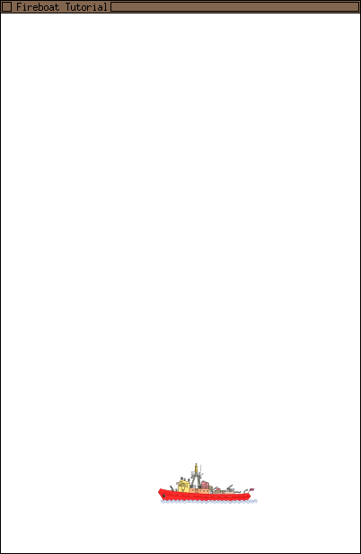

# Learning LÖVE

## Creating a window and drawing the boat

For our first game -- a Fireboat throwing water at flames falling from the sky --  we create a `Fireboat/` directory somewhere on your computer (`Documents` is a good place for it) . This directory will contain all the files for our game.

Start the [text editor](glossary#text-editor) and create the `conf.lua` file:

~~~.lua
-- Configuration file that gets read by Löve
function love.conf(t)
    t.title = "Fireboat Tutorial"
    t.version = "0.9.1" -- The LÖVE version targetted
    t.window.width = 400
    t.window.width = 600

    t.console = true -- For debuggingg on windows
end
~~~

The `conf.lua` file is automatically read by LÖVE. The `love.conf(t)` function we define in `conf.lua` is automatically executed before the game starts.

The main attributes we are setting in the configuration file are the title and the size of the window where the game will be shown.

A [complete list of the attributes](http://www.love2d.org/wiki/Config_Files) you can set can be found in the LÖVE wiki.

In the same `Fireboat` directory we create another file called `main.lua` where we will write the game's logic.

~~~.lua
debug = true

playerImg = nil

--[[
Called whe the program starts: allows us to load the assets
--]]
function love.load(arg)
    playerImg = love.graphics.newImage('assets/fireboat.png')
end

--[[
Called for each frame
--]]
function love.draw()
    love.graphics.draw(playerImg, 175, 500) -- Draw it towards the bottom of the window
end
~~~

In the same way as LÖVe is calling the `love.conf(t)` function we have defined in `conf.lua`, LÖVe will also:

- run `love.load(arg)` when the program starts.
- run `love.draw()` each time it redraws the window.

In this very first version our game is loading the `fireboat.png` image and drawing it at the coordinates `175, 500`.

As you might have guessed, before we can run the program, we have to create an `assets/` directory inside of our game's directory and copy into there the `fireboat.png` image file.

Our application is ready to run!

As explained in the Getting started chapters for [Linux](TODO), [Mac OS X](TODO), and [Windows](TODO), depending on your operating system and your personal preferences you can now

- drag the the `Fireboat/` directory on the `Love` application icon (preferred for Windows and OS X) or
- run `love Fireoboat/` in the terminal while being in the directory above the `Fireoboat/` directory (preferred for Linux)

You can close the game by clicking on the close icons your system will have add to your window (TODO: add small screenshots for some Window managers).

The source for this first example can be found on [GitHub](TODO).

##
