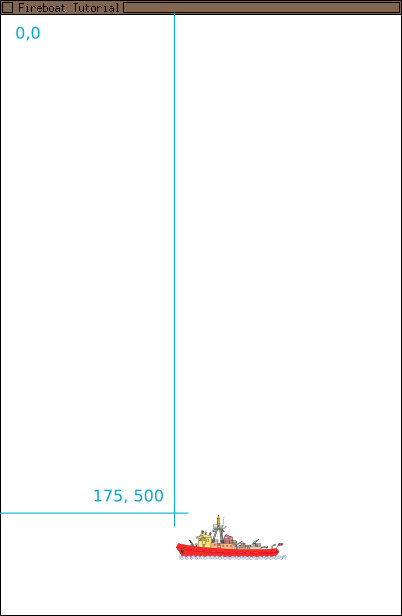
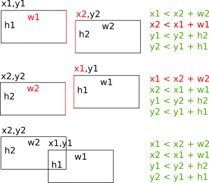

# Your first game with LÖVE - Fireboat

We are now ready to put our hands into LÖVE and create our first game: a Fireboat throwing water at flames falling from the sky.

## Setup the game and draw the fireboat

For our first game we create a `Fireboat` directory somewhere on your computer (`Documents` is a good place for it but some will prefer to create it on the `Desktop`) . This directory will contain all the files for our game (and nothing else).

Start the [text editor](glossary#text-editor) and create the `conf.lua` file:

~~~.lua
-- Configuration file that gets read by Löve
function love.conf(t)
    t.title = "Fireboat Tutorial"
    t.version = "0.10.1" -- The LÖVE version targetted 
    t.window.width = 400
    t.window.height = 600

    t.console = true -- For debugging on windows
end
~~~

The `conf.lua` file is automatically read by LÖVE. The `love.conf(t)` function we define in `conf.lua` is automatically executed before the game starts.

The main attributes we are setting in the configuration file are the title and the size of the window when the game will be shown. If you have downloaded a newer version of Löve you need to adjust the `t.version` variable to match the downloaded version or Löve will show you a "Compatibility Warning".

A [complete list of the attributes](http://www.love2d.org/wiki/Config_Files) you can set can be found in the LÖVE wiki.

Our next step is to create the image of the fireboat we want to draw. Images for the game belong into a subdirectory of the `Fireboat` directory called `assets`. Go ahead and create that now. Then browse the internet to find a suitable image for the fireboat. Use your favorite image editing tool to shrink it to perhas 150 x 100 pixels and savie it as a `.png` file in our new `assets` directory.

Now move back to the `Fireboat` and create another file called `main.lua` with the text editor where we will write the game's code.

~~~.lua
debug = true

playerImg = nil

--[[
Called when the program starts: allows us to load the assets
Called exactly once.
--]]
function love.load(arg)
    playerImg = love.graphics.newImage('assets/fireboat.png')
end

--[[
Called very often by the love engine
--]]
function love.draw()
    love.graphics.draw(playerImg, 175, 500) -- Draw it towards the bottom of the window
end
~~~

In the same way as LÖVE is calling the `love.conf(t)` function we have defined in `conf.lua`, LÖVE will also:

- call `love.load(arg)` once when the program starts.
- call `love.draw()` very frequently to redraws the window.

We call these `callback` functions as the LÖVE decides when to call them but we get to write what they do.
In this very first version our game is loading the `fireboat.png` image and drawing it at the coordinates `175, 500`.

Our application is ready to run!

As explained in the Getting started chapters for [Linux](TODO), [Mac OS X](TODO), and [Windows](TODO), depending on your operating system and your personal preferences you can now

- On Windows or Mac drag the the `Fireboat` directory onto the `Love` application icon or
- On Linux run  `love .` in the terminal while being inside the `Fireoboat` directory

You can close the game by clicking on standard close icon of the window.

## Stearing the Boat

In our game, the Fireboat will move to the left and the right, avoiding the falling fire flames and throwing water at them.

The first step is to define the boat position in an object that we can manipulate:

~~~.lua
debug = true

player = { x = 175, y = 500, img = nil }

--[[
Called when the program starts: allows us to load the assets
--]]
function love.load(arg)
    player.img = love.graphics.newImage('assets/fireboat.png')
end

--[[
Called for each frame
--]]
function love.draw()
    love.graphics.draw(player.img, player.x, player.y) -- draw it towards at the position (x, y)
end
~~~

The `fireboat.png` image, the horizontal (`x`) and the vertical (`y`) position are now defined inside of the `player` structure. The `player`'s fields are used for loading the image `love.load()` and then for drawing it in `love.draw()` at the position defined by `player.x` and `player.y`.

A remark: the coordinates have their origin -- the `(0, 0)` point -- in the top left corner: `(175, 500)` is the distance in pixels from the top left corner of the bounding box around the image and the top left corner of the window.

We are now ready for binding the boat's movements with the keyboard:

~~~.lua
debug = true

player = { x = 175, y = 500, speed = 150, img = nil }

--[[
Called when the program starts: allows us to load the assets
--]]
function love.load(arg)
    player.img = love.graphics.newImage('assets/fireboat.png')
end

--[[
Called for each frame
@param numeric dt time elapsed since the last call
--]]
function love.update(dt)
    -- We need a way to get out of the game...
    if love.keyboard.isDown('escape') then
        love.event.push('quit')
    end

    -- Left arrow and 'a', to the left, right arrow and 'd' to the right...
    if love.keyboard.isDown('left','a') then
        player.x = player.x - (player.speed * dt)
    elseif love.keyboard.isDown('right','d') then
        player.x = player.x + (player.speed * dt)
    end
end

--[[
Called for each frame
--]]
function love.draw()
    love.graphics.draw(player.img, player.x, player.y) -- draw it towards at the position (x, y)
end
~~~

We are adding a `love.update()` function that triggers the `quit` event when the `ESC` key is pressed and changes the boat's `x` position  when the arrow keys or the `a` / `d` keys are pressed.

Each movement of the player is calculated by multiplying the `speed` field -- it's the new field in the player's structure -- by the "delta-time" (`dt`) variable that LÖVE is giving us as parameter to the `love.update()` function.  
`dt` is the time elapsed since the last time LÖVE has called `love.update()` and is used to make the game run at the same pace on computers with different speeds.  
If you want the boat to react faster or slower to the commands, you can modify the value of `player = { .... speed = 150 ...}`.

After each modification of your code, you should run the game and test if the changes have the expected result. If you have done so, you will have noticed that the boat can "sail" out of the window.  
When the key is pressed, we should make sure that the boat cannot go over the border: the `math.max()` and `math.min()` ensure that the boat's `x` value is never smaller than `0` nor bigger than the window's width. Since the position of the boat gets calculated by it's top left corner, for the right side check we have to add the width of the boat itself.

~~~.lua
debug = true

player = { x = 175, y = 500, speed = 150, img = nil }

--[[
Called when the program starts: allows us to load the assets
--]]
function love.load(arg)
    player.img = love.graphics.newImage('assets/fireboat.png')
end

--[[
Called for each frame
@param numeric dt time elapsed since the last call
--]]
function love.update(dt)
    -- We need a way to get out of the game...
    if love.keyboard.isDown('escape') then
        love.event.push('quit')
    end

    -- Left arrow and 'a', to the left, right arrow and 'd' to the right...
    if love.keyboard.isDown('left','a') then
        player.x = math.max(player.x - (player.speed * dt), 0)
    elseif love.keyboard.isDown('right','d') then
        player.x = math.min(player.x + (player.speed * dt), love.graphics.getWidth() - player.img:getWidth())
    end
end

--[[
Called for each frame
--]]
function love.draw()
    love.graphics.draw(player.img, player.x, player.y) -- draw it towards at the position (x, y)
end
~~~

The source for this stage of the game can be found on [GitHub](TODO).

## Throwing water drops

Now that we are able to stear our boat, we can get to the next task: throw water drops.

First you need an image for drop. You can draw your own or download the one we're using for our sample code: [drop.png](https://raw.githubusercontent.com/CoderDojoZH/workshops/master/lua-love/step-03/assets/drop.png).

In `love.update()` we add the code to detect when the space bar is pressed (`love.keyboard.isDown(' ')`).  
The `newDrop` is based in the `drop` structure we define at the beginning of the program and gets inserted in the `drops` list (also newly defined at the beginning of the program):

~~~.lua
-- Create a bullet on space at the boat position
if love.keyboard.isDown(' ') then
    newDrop = { x = player.x + (player.img:getWidth()/2), y = player.y, speed = drop.speed, img = drop.img }
    table.insert(drops, newDrop)
end
~~~

We also want the drop to move upwards until it reaches the top of the window: each time `love.update()` gets called, each drop moves up according to `drop.speed`:

~~~.lua
-- Scroll up the position of the drops
for i, drop in ipairs(drops) do
    drop.y = drop.y - (drop.speed * dt)

    if drop.y < 0 then -- Remove bullets when they pass off the screen
        table.remove(drops, i)
    end
end
~~~

Since the drops are moving up, we remove the speed from the current drop position.

The `ipars(drops)` function gives as each drop and the matching `i` position in the list. We use the `i` index to remove the drop from the list if it has passed off the screen.

In the `love.draw()` function we loop again through all the `drops` and display each of them at its `drop.x` and `drop.y` coordinate.

~~~.lua
function love.draw()
    for i, drop in ipairs(drops) do
        love.graphics.draw(drop.img, drop.x, drop.y)
    end
    love.graphics.draw(player.img, player.x, player.y)
end
~~~

A remark: in the `for i, drop  in ipairs(drops)` loop we are defining a local `drop` variable: it's not a problem to use the same name as the global `drop` structure, but inside of the `for` loop we cannot access the global `drop` (for more information see the short section on ["Scope"](learning-lua#scope) in the ["Learning Lua"](learning-lua) chapter.

~~~.lua
debug = true

player = { x = 175, y = 500, speed = 150, img = nil }
drop = { speed = 250, img = nil }
drops = {} -- List of bullets currently being drawn and updated

--[[
Called when the program starts: allows us to load the assets
--]]
function love.load(arg)
    player.img = love.graphics.newImage('assets/fireboat.png')
    drop.img = love.graphics.newImage('assets/drop.png')
end

--[[
Called for each frame
@param numeric dt time elapsed since the last call
--]]
function love.update(dt)
    -- We need a way to get out of the game...
    if love.keyboard.isDown('escape') then
        love.event.push('quit')
    end

    -- Scroll up the position of the drops
    for i, drop in ipairs(drops) do
        drop.y = drop.y - (drop.speed * dt)

        if drop.y < 0 then -- Remove bullets when they pass off the screen
            table.remove(drops, i)
        end
    end

    -- Create a bullet on space at the boat position
    if love.keyboard.isDown(' ') then
        newDrop = { x = player.x + (player.img:getWidth()/2), y = player.y, speed = drop.speed, img = drop.img }
        table.insert(drops, newDrop)
    end

    -- Left arrow and 'a', to the left, right arrow and 'd' to the right...
    if love.keyboard.isDown('left','a') then
        player.x = math.max(player.x - (player.speed * dt), 0)
    elseif love.keyboard.isDown('right','d') then
        player.x = math.min(player.x + (player.speed * dt), love.graphics.getWidth() - player.img:getWidth())
    end
end

--[[
Called for each frame
--]]
function love.draw()
    for i, drop in ipairs(drops) do
        love.graphics.draw(drop.img, drop.x, drop.y)
    end
    love.graphics.draw(player.img, player.x, player.y)
end
~~~

At thend of this tutorial, the full code for our game will count around 150 lines of code. We are currently at about 50 lines of code right now: but it's already getting too long for the full code being reproduced at each step.  
From this point on, we will show the new code to be typed and describe where it should be inserted. Of course, we will continue providing links to the external repository where you can see to the full code at each stage, so that you can cross check your code, if you think you made an error.

The full code for this stage is on [Github](https://github.com/CoderDojoZH/workshops/blob/master/lua-love/step-03/).

## Limiting the water throughput

Right now, when you keep on pressing the space bar a big column of water is thrown out. Our next task is to enfoce a small interval between two drops.

We define the interval by extending the `drop` structure with the two fields `interval` and `intervalTimer`:

~~~.lua
drop = { speed = 250, img = nil, interval = 0.2, intervalTimer = 0 }
~~~

Each time we produce a drop, we set `drop.intervalTimer` to the value of `drop.interval` and let the `love.update()` function decrease the `drop.intervalTimer` by 1 multiplied by the `dt` parameter.  We also add a condition that only lets process the action bound to the space bar if the `drop.intervalTimer` is smaller than 0:

~~~.lua
-- Decrease the drop interval timer before the next drop
drop.intervalTimer = drop.intervalTimer - (1 * dt)

-- Create a drop on space at the boat position if intervalTimer got back to zero
if love.keyboard.isDown(' ', 'space') and drop.intervalTimer < 0 then
    newDrop = { x = player.x + (player.img:getWidth()/2), y = player.y, speed = drop.speed, img = drop.img }
    table.insert(drops, newDrop)
    drop.intervalTimer = drop.interval
end
~~~

Your game should now look similar to this:

The full code for this stage is on [Github](https://github.com/CoderDojoZH/workshops/blob/master/lua-love/step-04/).

## Adding the falling flames

~~~.lua
flame = { speed = 200, img = nil, interval = 0.4, intervalTimer = 0 }
flames = {} -- List of flames currently being drawn and updated
~~~

~~~.lua
function love.load(arg)
    -- ...
    flame.img = love.graphics.newImage('assets/flame.png')
end
~~~

~~~.lua
function love.update(dt)
    -- ...

    -- Decrease the drop interval timer before the next drop/flame
    -- ...
    flame.intervalTimer = flame.intervalTimer - (1 * dt)

    -- Create a flame at the top with a random x position if intervalTimer got back to zero
    if flame.intervalTimer < 0 then
        randomX = math.random(10, love.graphics.getWidth() - 10)
        newFlame = { x = randomX, y = -10, speed = flame.speed, img = flame.img }
        table.insert(flames, newFlame)
        flame.intervalTimer = flame.interval
    end
    -- ...
end
~~~

Append just after the scrolling down of the drops, the scrolling up of the flames:

~~~.lua
-- Scroll down the position of the flames
for i, flame in ipairs(flames) do
    flame.y = flame.y + (flame.speed * dt)

    if flame.y > love.graphics.getHeight() then -- Remove bullets when they pass off the screen
        table.remove(flames, i)
    end
end
~~~

And draw each flame...

~~~.lua
function love.draw()
    -- ...
	for i, flame in ipairs(flames) do
		love.graphics.draw(flame.img, flame.x, flame.y)
	end
    -- ...
end
~~~

Your game should now look similar to this:

The full code for this stage is on [Github](https://github.com/CoderDojoZH/workshops/blob/master/lua-love/step-05/).

## Extinguishing the fire

The fire is falling down, the drops are flying up... It's time for something to happen: when a drop touches a flame, the fire extinguishes and the water evaporates. In "game" speach we have to do some "collision detection" and remove both the flame and the drop from their respective list.

Right at the top of the file -- just after the definitions for the `player` and `drop` structures we add a "standard" function from the [LÖVE wiki](http://love2d.org/wiki): the `checkCollision()` function will return `true` if the rectange 1 is touching the object 2.

~~~.lua
--[[
Collision detection taken function from http://love2d.org/wiki/BoundingBox.lua
Returns true if two boxes overlap, false if they don't
x1,y1 are the left-top coords of the first box, while w1,h1 are its width and height
x2,y2,w2 & h2 are the same, but for the second box
--]]
function checkCollision(x1,y1,w1,h1, x2,y2,w2,h2)
    return
        x1 < x2+w2 and
        x2 < x1+w1 and
        y1 < y2+h2 and
        y2 < y1+h1
end
~~~

The first rectanlge is defined through its top left point (`x1, y1`), its width (`w1`) and height (`h1`). The second one by `x1,y1`, `w2` and `h2`.

There is a collision if the rectangles 1 and 2 intersect: that is, 1's left side (`x1`) is left (`<`) of 2's right side (`x2 + w2`) and 1's left side (`x2`) is left (`<`) of 2's right side (`x1 + w1`). And the same applies to the 1 and 2's top and bottom sides.  
As already mentioned, for the vertical check you should take into consideration that the coordinate origin is top left (and they grow down).

This is called an algorithm, a list of specific instructions a computer should perform.

We can now use the `checkCollision()` function to check if any of the drops moving up is touching one of the flames falling down: if it's the case, we simply remove both of them from their respective lists.

~~~.lua
--[[
Collision detection
Since there will be fewer flames on screen than bullets we'll loop them first
--]]
for i, flame in ipairs(flames) do
    for j, drop in ipairs(drops) do
        if checkCollision(flame.x, flame.y, flame.img:getWidth(), flame.img:getHeight(), drop.x, drop.y, drop.img:getWidth(), drop.img:getHeight()) then
            table.remove(drops, j)
            table.remove(flames, i)
        end
    end
end
~~~

At first sight, it looks like a rather complex process: We loop through all flames (the first `for`) and check if the current flame collides with the any of the drops (the second `for` inside of the first one).  
When programming, if you want to check if things "are matching", you mostly have to check each of the possibility and cannot use the common sense to quickly check the most likely ones.  But computers are fast at going through lists!

## Getting hit by the fire

Each flame that is not caught by the water, can hit the ship make it sink

We first add an `alive` property to the `player` structure:
~~~.lua
player = { x = 175, y = 500, speed = 150, img = nil, alive = true }
~~~

TODO: should alive be replaced by burning?

As soon as player.`alive` is set to false, we will know that the game is over.

We can use the same `for i, flame in pairs(flames) do` loop in `update()` and the existing `checkCollision()` function to check if a flame has hit the boat.

~~~.lua
function love.update(dt)
    -- ...
    for i, flame in ipairs(flames) do
        -- ...

        if checkCollision(flame.x, flame.y, flame.img:getWidth(), flame.img:getHeight(), player.x, player.y, player.img:getWidth(), player.img:getHeight()) 
        and player.alive then
            table.remove(flames, i)
            player.alive = false
        end
    end
end
~~~

What should happen when the player is not _alive_? The simplest answer is: nothing should happen aynmore. And the simplest way to make _nothing_ happen is to wrap all the content of the `love.draw()` function in a _is alive_ condition:

~~~.lua
function love.draw()
    if player.alive then
        -- ...
    end
end
~~~
Now, the flames, the drops and the boat are only drawn if the player is alive.

The game is working now! But once you get hit you have to get ouf the game and launch it again to ge a new boat: in the next section we will improve that!

## Restarting the game

When the boat is on fire, we want to give the player the change to start a new game. In the `love.draw()` we improve the `if player.alive` condition by showing a message when the player is not alive:

~~~.lua
function love.draw()
    if player.alive then
        -- ...
    else
        love.graphics.print("Press 'R' to restart", love.graphics:getWidth()/2-50, love.graphics:getHeight()/2-10)
    end
end
~~~

When the player is not `alive`, the content of the `else` to the condition makes the `Press 'R' to restart` message to be rendered in the middle of the window.

In a similar way as we are doing with the other key presses, we add a check for the `r` key at the end of the `love.update()` function:

~~~.lua
function love.update(dt)
	-- ...
	if not player.alive and love.keyboard.isDown('r') then
		-- remove all drops and flames
		drops = {}
		flames = {}

		-- reset timers
		drop.intervalTimer = 0
		flame.intervalTimer = 0

		-- move player back to default position
		player.x = 175
		player.y = 500

		-- reset our game state
		player.alive = true
	end
end
~~~

When the player is not _alive_ and the `r` key has been ressed, we reset all the structures to the values they were having at the beginning of the game:
- we empty the list of drops and flames,
- we reset the values of the timers ,
- move the player to the starting point,
- and set the player as _alive_

## Keeping the score

Finally, you will probably want to know how good you are at the game: for it, we need to keep the score: we will give one point each time a flame gets estinguised by the water.

The first step is to add a `point` field in the `player` structure.

~~~.lua
player = { x = 175, y = 500, speed = 150, img = nil, points = 0, alive = true }
~~~

Increasing the points is pretty simple: each time we detect a collision between a flame and a drop, we increment `player.score` by one.

~~~.lua
function love.update(dt)
	-- ...
	for i, flame in ipairs(flames) do
		for j, drop in ipairs(drops) do
			if checkCollision(flame.x, flame.y, flame.img:getWidth(), flame.img:getHeight(), drop.x, drop.y, drop.img:getWidth(), drop.img:getHeight()) then
				table.remove(drops, j)
				table.remove(flames, i)
		        player.score = player.score + 1
			end
		end
		-- ...
~~~

In order to display the current score, we add two lines at the end of the `love.draw()` function:

~~~.lua
function love.draw()
    -- ...
    love.graphics.setColor(255, 255, 255)
    love.graphics.print("SCORE: " .. tostring(player.score), 400, 10)
end
~~~

First we set the color to white through `love.graphics.setColor(255, 255, 255)`: the color being composed by [red, green and blue](glossary#rgb-color) mixing lot of each base color will give us white (255 is the maximum we can set).

Just after that, we add in the top right corner a text saying `SCORE: ` followed by the current value for the score.

Finally, we want to reset the score when the game restarts:

~~~.lua
function love.update(dt)
    -- ...
	if not player.alive and love.keyboard.isDown('r') then
        -- ...

		-- reset the score
        score = 0

        -- reset our game state
        player.alive = true
    end
end
~~~
