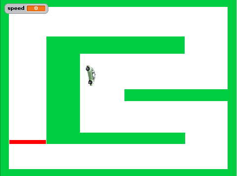
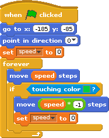
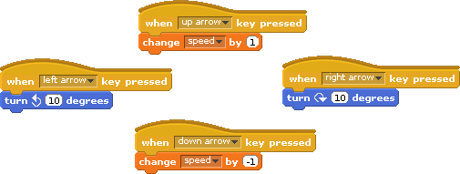
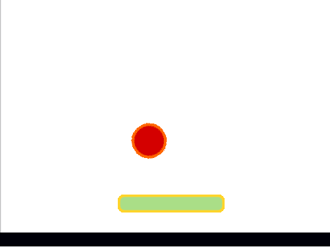
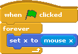
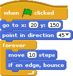
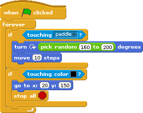

# Introducing Scratch

- A good introduction to Scratch-like programming  
  https://blockly-demo.appspot.com/static/apps/maze/index.html and  
  https://blockly-games.appspot.com/bird  
  and generally  
  https://blockly-demo.appspot.com  
  and  
  https://blockly-games.appspot.com
- a self-learning tutorial by <http://kinderlabor.ch>: http://scratch.mit.edu/projects/23844258/ : learn in 5 minutes how to create a racing car game.

# Blocks of code to create

### Each keypress is a move

Key is pressed and character moves several steps. Sprite moves only if key is pressed/held

- moving on a grid

## Move/Steering

How the character can move in different directions.  

### Keypresses set the speed and direction

Key is pressed and character starts moving in a given direction. Sprite moves after releasing a key.

### Example: Racing Car

The "on start" loop:

- Initialize the position, the direction and the speed
- Forever:
  - Move speed steps
  - Stop if it hits a wall

Set the speed and direction with "on keys" events:

- The up and down keys increase / decrease the speed
- The left and righ arrow let the car turn by 10°

## Turns left/right

## Jumping

[a.l.e]

- https://www.youtube.com/watch?v=4YoGkwV7D9c a good 15 min tutorial on jumping

1. Jump upwards
2. Jump diagonally

## Hit a wall - Bartosz takes it over
1. When wall is hit, stop the character
2. When wall is hit, bounce the character

## Hit an object

### Bounce when hitting an object

### Pong

Based on [pong](http://scratch.mit.edu/projects/10128515/#editor)

The paddle: just moves horizontally to the mouse (setx)

The ball:
- Two "on start" scripts
  - go to the start position, point to 45°, then bounce on wall and move 10 steps forever  
    
  - forever do: if touching paddle, turn 160°-200° and move 10 steps  
    
  - Idea for a starting point: give a pong with paddle and ball with the ball bouncing to the wall but not to the paddle

### Interact with an object when hitting it

another example: bricks game (with changing color)

When object is hit, do some interaction
  a. change color
  b. send message
  c. move

## Throw an object
As a result of some event an object can be created and thrown

## Frequency of key presses
How often is a key pressed in some short amount of time.
Eg. for olympic games: if there are enough presses per second, then the character moves faster

## Animate sprites
Change costumes when character moves. Change direction of a character during movement.
1. The character can be increased permanently (eg. Mario)
2. Sprite can pulse several times to catch attention
3. Sprite can shake either to sides or with small turns 

## Count points
This may be needed for several players

## Display something on start of the game
Eg. 3 2 1 Start

## Scrolling background
I am not sure if it is possible and would consider it a secondary target.

## Scrolling sprites

This can be useful for "go to right" games.

- https://www.youtube.com/watch?v=4YoGkwV7D9c a 15 min tutorial on jumping
