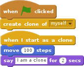
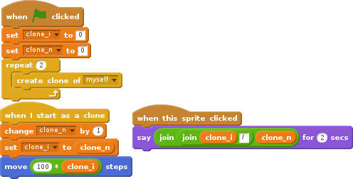

# Cloning Sprites

If you have multiple items that are very similar it can be worth use the script to clone a single sprite rather than creating lot of sprites.

If the items do not look all the same, you can set their look by using costumes.

This way, it's easier to test if a sprite is interacting with any of the cloned sprites.

## Cloning a sprite

For creating a clone you simple use the `Create clone` in the `control` Section

We are using the `When I start as a clone` control, to move the created clone and to let it say a message when it has been created.

## Identifying the clones

If you're creating muliple clones, you want to be able to know which clone it is. We achieve this by using two variables:

- `clone_n` is a global variables counting the number of exising clones
- `clone_i` is a variable local to the sprite with the number of the current clone.

Both are initialized to zero, when the script is starting.

For each clone created, the global variable `clone_n` gets incremented by one and the current value is assigned to the `clone_i` that is private to that specific clone.  
That way, we have only one `clone_n` that is valid for each cloned sprite and a `clone_i` that can be used to identify the specific clone.

By clicking on each cross, you can see that they have a different `i`, but the same `n`.

## Clones and costumes

