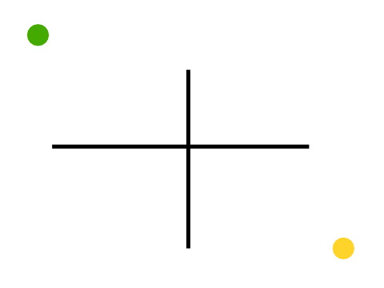

# Labyrinth solving with Scratch

The goal is to create a script that let's you get from an arbitrary start point to a goal by avoiding obstacles.

A typical example is getting around in a labyrinth.

This workshop can be organised as a contest among small group of programmers.

## Running the workshop

### Programming the robot

- The ninja should form small groups.
- Download the sample background.
- Choose a sprite and scale it down to the size of the circle.
- Create your program:
  - which should start when pressing the green flag,
  - allows any predefined start position,
  - does not need (nor allow) any further mouse or keyboard interaction.

### Rules

- The sprite should be about the size of the start and end circles.
- The sprite is not allowed to go over the black lines.

Of course:

- The ninjas can modify the background to better test their robot (or create new backgrounds)

### The contest

- Download the contest background and add it to your program.
- Place the robot on the start circle.
- When everybody is ready, each group starts the program at the same time...
- and the first reaching the target is the winner!

## Resources

- The training background  
    
  [base.svg](base.svg)  
- A [sample simple implementation](simple.sb)
- A labyrinth
