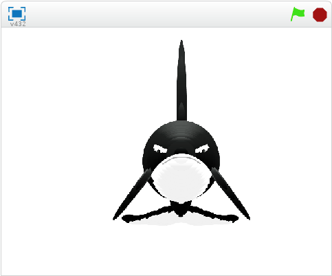
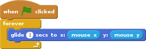
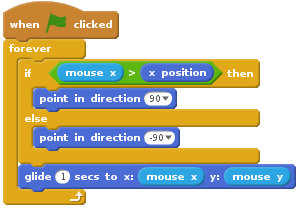
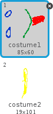
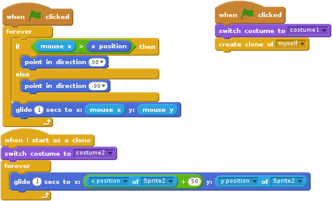

# The wiggling snake

This project documents step by step how to create a snake that wiggles following the mouse cursor.

It is inspired by the [floating orca](http://scratch.mit.edu/projects/16795490/) by NickyNouse

## The floating orca

The original floating orca looks like this

has 45 costumes which manage to give a 3D view of the orca.

The scripts NickyNouse has created for his orca are a bit dense. Here are the most important steps:

-
-
-

## Getting to a doable project

In our project we will simplify the task and aim at a 2D snake wiggling around.

We will have to tell the ninja that:

- we cannot do something as complex as the orca,
- there are a few steps the ninja has to go through before being able to build the simpler project.

## Following the mouse cursor

If you want your sprite to follow the mouse pointer, it's as easy as using the `go to [mouse pointer]` in `motion`. Here we want have a more gently movement and have to create some very short code to get the sprite to glide to the current mouse position:

One more detail: if our sprite -- like the snake head -- has a direction, it will have to turn it according to the direction of its movement:

## The simplest snake: a head and a line

First, we will have to draw the snakes head and the first element of its tail.

Of course, ou can draw it left to right as i did, or loking down (or up). As you prefer.

Now we have to get the tail to follow the head, with a small delay.

The core parts of this script are:

- The sprite glides to the mouse position and turns to the right or left depending on which side of the cursor it currently is.
- On start, a clone is created.
- When the clone is created, it starts gliding to the head's position, 50 points more on the right side.

Your "snake" should look similar to this:

You will notice that the tail is always on the same side of the head, even if the head is turned on the other side. We will fix that, later.

## Cloning the costumes

## Getting the costumes to be skewed

## Getting a nice snake

## Learning goals

## Following the mouse, DIY

- simplify the project
- define doable steps
- gently moving a sprite to a specific point
